# 🔍 ANÁLISE DE CACHE - Frontend React

## 📊 Resumo Executivo

| Página | Status | URLs Hardcoded | Cache Mode | Problema |
|--------|--------|----------------|------------|----------|
| Financeiro.jsx | ✅ CORRETO | Não | `/api/cache/` | Nenhum |
| Clientes.jsx | ⚠️ PARCIAL | Não | API dinâmica | Não usa cache |
| Estoque.jsx | ⚠️ PARCIAL | Não | API dinâmica | Não usa cache |
| Vendas.jsx | ❌ CRÍTICO | ✅ 5x | API dinâmica | URLs hardcoded |
| Comercial.jsx | ✅ OK | Não | Dados estáticos | Sem chamadas API |

---

## 🎯 Análise Detalhada

### 1. Financeiro.jsx ✅ CORRETO

**Status**: ✅ Implementado corretamente  
**Linha**: 47

```jsx
const url = '/api/cache/financeiro_dashboard.json';
```

**Por quê está correto**:
- ✅ Usa URL **relativa** `/api/cache/`
- ✅ Flask detecta automaticamente se dev ou prod
- ✅ Retorna de `cache_dev/` (dev) ou `cache/` (prod)
- ✅ Sem hardcoding de IPs ou portas
- ✅ Modo **cache-only** (sem chamadas diretas)

**Recomendação**: Nenhuma mudança necessária

---

### 2. Clientes.jsx ⚠️ PARCIAL (Sem Cache)

**Status**: ⚠️ Usa API dinâmica, não usa cache  
**Linhas**: 26, 47

```jsx
const response = await fetch('/api/clientes');                 // Linha 26
const response = await fetch('/api/clientes/latest');          // Linha 47
```

**Problemas**:
- ❌ Faz chamadas **diretas à API** ao invés de cache
- ✅ Usa URLs relativas (bom para dev/prod)
- ⚠️ Não aproveita cache mesmo quando disponível

**Impacto**:
- Clientes_dashboard demora **11+ minutos** para atualizar
- Chamadas diretas sobrecarregam API em cada acesso

**Opções de Solução**:
1. **Usar cache** como Financeiro (mais rápido)
   - Perder dados em tempo real
   - Economizar 11+ minutos por atualização
   
2. **Manter API dinâmica** (dados atualizados)
   - Continua lento (11+ minutos)
   - Precisa otimizar backend

3. **Híbrido** (cache + atualização manual)
   - Carrega cache rápido
   - Botão de refresh traz dados novos

**Recomendação**: Híbrido (opção 3)

---

### 3. Estoque.jsx ⚠️ PARCIAL (Sem Cache)

**Status**: ⚠️ Usa API dinâmica, não usa cache  
**Linha**: 35

```jsx
const response = await axios.get('/api/estoque');
```

**Problemas**:
- ❌ Faz chamadas **diretas à API** ao invés de cache
- ✅ Usa URLs relativas (bom para dev/prod)
- ⚠️ Não aproveita cache

**Impacto**:
- Estoque_dashboard demora **3+ minutos** para atualizar
- Chamadas diretas em cada acesso

**Recomendação**: Mesmo padrão Clientes (implementar cache)

---

### 4. Vendas.jsx ❌ CRÍTICO (URLs Hardcoded)

**Status**: ❌ **Crítico** - URLs hardcoded com IP fixo  
**Linhas**: 38, 69, 108, 139, 164, 194

```jsx
fetch('http://192.168.20.10:5000/api/kpis/sales-evolution')      // Linha 38
fetch('http://192.168.20.10:5000/api/kpis/top-products', ...)    // Linha 69
fetch('http://192.168.20.10:5000/api/kpis/sales-by-channel', ...) // Linha 108
fetch('http://192.168.20.10:5000/api/kpis/sales-by-representative', ...) // Linha 139
fetch('http://192.168.20.10:5000/api/kpis/sales', ...)           // Linha 164
fetch('http://192.168.20.10:5000/api/kpis/sales', ...)           // Linha 194
```

**PROBLEMAS GRAVES**:
1. ❌ **IP hardcoded**: `192.168.20.10` → só funciona naquela máquina
2. ❌ **Porta hardcoded**: Sempre `5000` → não funciona em dev (5001)
3. ❌ **Não usa proxy** do package.json
4. ❌ **Dev e Prod quebrados** quando rodados em qualquer outro lugar

**Impacto**:
- ❌ Não funciona em dev (porta 5001)
- ❌ Não funciona em outra máquina (IP diferente)
- ❌ Não funciona com Docker/cloud (IPs dinâmicos)

**Recomendação**: **Urgente** - Corrigir para URLs relativas

---

### 5. Comercial.jsx ✅ OK (Sem API)

**Status**: ✅ Dados estáticos, sem problemas  
**Método**: Dados hardcoded no componente (funilData, pedidosVendedor, etc)

**Por quê está ok**:
- Sem chamadas de API
- Sem URLs problemáticas
- É um dashboard estático (para exemplo visual)

**Nota**: Quando quiser dinamizar, aplicar mesmo padrão de Financeiro

---

## 🛠️ Como Estão Buscando Cache Atualmente

```mermaid
graph TB
    subgraph Financeiro["✅ FINANCEIRO - CORRETO"]
        F1["Financeiro.jsx"]
        F2["/api/cache/financeiro_dashboard.json"]
        F3["Flask detecta FLASK_ENV"]
        F4["Retorna de cache_dev/ ou cache/"]
        F1 -->|busca| F2
        F2 -->|Flask| F3
        F3 -->|retorna| F4
    end

    subgraph Clientes["⚠️ CLIENTES - SEM CACHE"]
        C1["Clientes.jsx"]
        C2["/api/clientes (chamada direta)"]
        C3["Backend busca BD"]
        C4["11+ minutos!"]
        C1 -->|busca direto| C2
        C2 -->|executa| C3
        C3 -->|demora| C4
    end

    subgraph Estoque["⚠️ ESTOQUE - SEM CACHE"]
        E1["Estoque.jsx"]
        E2["/api/estoque (chamada direta)"]
        E3["Backend busca BD"]
        E4["3+ minutos"]
        E1 -->|busca direto| E2
        E2 -->|executa| E3
        E3 -->|demora| E4
    end

    subgraph Vendas["❌ VENDAS - URLS HARDCODED"]
        V1["Vendas.jsx"]
        V2["http://192.168.20.10:5000/..."]
        V3["❌ Não funciona em outras máquinas!"]
        V4["❌ Não funciona em dev (5001)!"]
        V1 -->|busca com IP fixo| V2
        V2 -->|problema| V3
        V2 -->|problema| V4
    end

    style Financeiro fill:#c8e6c9,stroke:#2e7d32,stroke-width:2px
    style Clientes fill:#fff9c4,stroke:#f9a825,stroke-width:2px
    style Estoque fill:#fff9c4,stroke:#f9a825,stroke-width:2px
    style Vendas fill:#ffcdd2,stroke:#c62828,stroke-width:2px
```



---

## 🚨 CRÍTICO: Vendas.jsx URLs Hardcoded

### O Problema

```javascript
// ❌ NÃO FUNCIONA EM:
// - Outra máquina (IP diferente)
// - Desenvolvimento (porta 5001)
// - Docker/Cloud (IP dinâmico)

fetch('http://192.168.20.10:5000/api/kpis/sales-evolution')
```

### Deveria Ser

```javascript
// ✅ FUNCIONA EM QUALQUER LUGAR
fetch('/api/kpis/sales-evolution')

// Ou usando api.js:
import { API_BASE_URL } from '../services/api';
fetch(`${API_BASE_URL}/api/kpis/sales-evolution`)
```

---

## 📋 Recomendações por Página

### ✅ Financeiro.jsx
- **Status**: Implementado corretamente
- **Ação**: Nenhuma (manter como está)
- **Priority**: 0 (já está ok)

### ⚠️ Clientes.jsx & Estoque.jsx
- **Status**: Sem cache, demora muito
- **Opção A - RÁPIDO**: Usar cache como Financeiro
- **Opção B - ATUAL**: Otimizar backend (parallelizar, indexar BD)
- **Opção C - HÍBRIDO**: Cache + botão manual refresh
- **Recomendação**: Opção C (melhor UX)
- **Priority**: Alta (11+ minutos é inaceitável)

### ❌❌ Vendas.jsx - URGENTE
- **Status**: CRÍTICO - URLs hardcoded
- **Problema**: Não funciona fora da máquina origem
- **Solução**: Trocar `http://192.168.20.10:5000` por `/`
- **Mudanças**: 6 locais precisam corrigir
- **Priority**: MÁXIMA (impede uso em outra máquina)

---

## 🔧 Ações Imediatas

### 1️⃣ Corrigir Vendas.jsx (10 minutos) - CRÍTICO

Substituir em 6 locais:
```javascript
// De:
fetch('http://192.168.20.10:5000/api/kpis/...')

// Para:
fetch('/api/kpis/...')
```

### 2️⃣ Implementar Cache em Clientes & Estoque (30 min)

Padrão a seguir (como Financeiro):
```javascript
const url = '/api/cache/clientes_dashboard.json'; // Novo endpoint
const response = await fetch(url);
const data = await response.json();
```

### 3️⃣ Garantir Dev/Prod Funcionem

Após estes passos:
- ✅ Dev (5001) funciona
- ✅ Prod (5000) funciona
- ✅ Outra máquina funciona
- ✅ Docker/Cloud funciona

---

## 📊 Impacto das Mudanças

| Página | Ação | Tempo | Usuário |
|--------|------|-------|--------|
| Financeiro | Manter | Instant | ✅ Instant |
| Clientes | Cache | 30m | 👍 11m → Instant |
| Estoque | Cache | 30m | 👍 3m → Instant |
| Vendas | Corrigir URL| 10m | 🎉 Funciona anywhere |

---

## ✅ Checklist

**Vendas.jsx - Urgente**:
- [ ] Linha 38: Mudar `http://192.168.20.10:5000` → `/`
- [ ] Linha 69: Mudar `http://192.168.20.10:5000` → `/`
- [ ] Linha 108: Mudar `http://192.168.20.10:5000` → `/`
- [ ] Linha 139: Mudar `http://192.168.20.10:5000` → `/`
- [ ] Linha 164: Mudar `http://192.168.20.10:5000` → `/`
- [ ] Linha 194: Mudar `http://192.168.20.10:5000` → `/`
- [ ] Testar em http://localhost:5001 (dev)
- [ ] Testar em http://localhost:5000 (prod)

**Clientes & Estoque - Próximas Sprints**:
- [ ] Criar `/api/cache/clientes_dashboard.json` se não existir
- [ ] Atualizar Clientes.jsx para usar cache
- [ ] Criar `/api/cache/estoque_dashboard.json` se não existir
- [ ] Atualizar Estoque.jsx para usar cache

---

## 📝 Notas Importantes

1. **Financeiro** está 100% correto - padrão a seguir
2. **Vendas** tem bug crítico que impede uso fora da máquina
3. **Clientes & Estoque** poderiam ser muito mais rápidos com cache
4. **Comercial** é estático (ok por enquanto)

**Próxima ação**: Corrigir Vendas.jsx imediatamente
